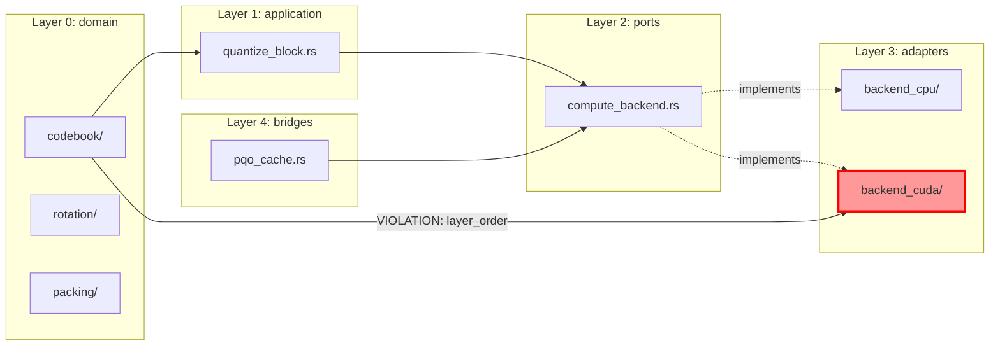

# Rustqual Architecture Module — Design Specification

**Version:** 0.1-draft · **Status:** Proposal · **Author:** Architecture Review
**Target release:** rustqual v0.x + 1 (after turboquant #050-#057 land)

## 0. Document purpose

This is a **concrete implementation spec** for adding architectural-rule enforcement to rustqual. It is detailed enough that a senior developer can implement the MVP from it, including TOML schema, CLI surface, AST-detection patterns, output formats, and test strategy.

## 1. Context & Goals

### Why in rustqual

Rustqual already enforces SRP / complexity / suppression health. Layered-architecture enforcement is a natural extension: same input (Rust source), same output channel (TOML config, exit code, `--format ai`), same CI integration. Adding it as a separate CLI would force users to manage two overlapping tools.

### Target users

1. **Developers of turboquant-rs** — enforce hexagonal layer rules, catch upward-dependency regressions in PR review
2. **Downstream crate authors** (mistral.rs, future embedders) — optional: define their own layer scheme for their domain
3. **Architecture reviewers** — ask for the `--graph` output to understand current state

### Success criteria

- Running `rustqual` (no args) on a configured project includes architecture check and fails CI on new violations
- Single `rustqual.toml` configures all rules
- Existing rustqual tests continue to pass unchanged
- First-time adoption: <30 minutes from `rustqual architecture --init` to green CI
- Ongoing regression detection: any new violation surfaces in the PR with a clear, actionable message

## 2. Scope

### In scope (MVP = v0.1)

- Layer definition via config (path-glob → layer name)
- Layer-order rule (lower layer must not import higher)
- Baseline mechanism (grandfather existing violations)
- Human + AI output formats
- Exit-code integration with existing rustqual CI flow
- Suppression via existing `qual:allow(architecture::*)` syntax

### In scope (v0.2)

- Forbidden-edge rule (A must not import B, beyond layer order)
- Symbol-policy rule (e.g., `extern "C"` only in adapter layer)
- Mermaid graph export

### In scope (v0.3+)

- Workspace-aware analysis (multi-crate Cargo workspace)
- Pub-use transparency (re-exports don't count as internal imports)
- Macro-expansion consideration

### Out of scope

- Runtime architecture checks (source-only)
- Cross-crate external dependency rules (`cargo-deny` territory)
- Automatic refactoring or "fix it" suggestions
- IDE integration / LSP (can be added later via `--format lsp`)

## 3. TOML Configuration Schema

Full schema with all keys, types, defaults, and validation rules.

```toml
# rustqual.toml — section [architecture]

[architecture]
# Master switch.
enabled = true                    # bool, default: false (opt-in)

# Where to find source files. Default: src/ relative to Cargo.toml.
source_roots = ["src"]            # [string], default: ["src"]

# Optional baseline of grandfathered violations. When set, violations
# already in the baseline file don't fail CI; only NEW ones do.
baseline_file = ".rustqual-architecture-baseline.json"  # optional string

# Max acceptable ratio of architecture-suppressed items to total items.
# Mirrors the existing `max_suppression_ratio` for other rustqual rules.
max_architecture_suppression_ratio = 0.02  # float, default: 0.05

# When true, warnings about `pub use` re-exports crossing layers are
# suppressed (re-exports are part of the public contract, not an internal dep).
# Default: true.
pub_use_transparent = true

# ── Layer definitions ──────────────────────────────────────────────────
# `order` is a list from lowest (innermost) to highest (outermost).
# The dependency rule: a file in layer N may `use crate::<x>` only when
# `<x>`'s layer is ≤ N.
[architecture.layers]
order = ["domain", "application", "ports", "adapters", "bridges"]

# Each layer maps to a list of glob patterns (relative to source_roots).
# First-match wins; files not matching any layer get implicit layer "root".
[architecture.layers.domain]
paths = [
    "domain/**",
    "errors.rs",          # top-level files can also be classified
    "math.rs",
]

[architecture.layers.application]
paths = ["application/**"]

[architecture.layers.ports]
paths = ["ports/**"]

[architecture.layers.adapters]
paths = ["adapters/**"]

[architecture.layers.bridges]
paths = ["bridges/**", "lib.rs"]

# Files not matching any `paths` block are implicit "root" layer.
# By default, root can import any layer (like lib.rs re-exporting).
# Override with:
# root_may_import = ["bridges"]  # restrict root's imports to a subset

# ── Forbidden edges (beyond layer order) ───────────────────────────────
# Even same-layer siblings can be forbidden (e.g., two adapter backends
# shouldn't know about each other).

[[architecture.forbidden]]
from = "adapters/backend_cpu/**"
to   = "adapters/backend_cuda/**"
reason = "Backends must not know about each other"

[[architecture.forbidden]]
from = "adapters/backend_cuda/**"
to   = "adapters/backend_cpu/**"
reason = "Backends must not know about each other"

[[architecture.forbidden]]
from = "domain/**"
to   = "**"
except = ["domain/**"]   # domain can only import within domain
reason = "Domain must remain framework-free"

# ── Symbol policies ────────────────────────────────────────────────────
# Pattern is a regex applied to:
#   - Every `use` statement's rendered path
#   - Every attribute (including cfg!)
#   - Every `extern` item
# Match → violation unless the containing file matches `allowed_in`.

[[architecture.symbol_policy]]
name = "ffi_only_in_adapter"
pattern = 'extern "C"'
allowed_in = ["adapters/backend_cuda/**", "adapters/backend_vulkan/**"]
reason = "FFI only in hardware adapters"

[[architecture.symbol_policy]]
name = "cuda_cfg_only_in_adapter"
pattern = '#\[cfg\(feature = "cuda"\)\]'
allowed_in = ["adapters/backend_cuda/**", "lib.rs"]
reason = "CUDA gates only at adapter boundary"

[[architecture.symbol_policy]]
name = "no_unsafe_in_domain"
pattern = '\bunsafe\s*(fn|\{|impl)'
forbidden_in = ["domain/**"]     # inverse: forbidden list instead of allowed list
reason = "Domain must not contain unsafe code"
```

### Schema validation rules (enforced at load time)

- `order` must be non-empty, all entries must have a corresponding `[architecture.layers.<name>]` section
- `paths` globs must be valid `glob::Pattern`
- Each forbidden/symbol_policy rule must have exactly one of `allowed_in` or `forbidden_in`
- Regex patterns must compile; invalid patterns fail early with a clear error
- `except` pattern must be a subset of `to` (partial overlap is a warning)

## 4. Rule Catalogue

Every rule has: a **name**, a **detection** description, and an **example violation + fix**.

### Rule 1: `layer_order_violation`

**Name:** `architecture::layer_order_violation`
**Detection:** A `use crate::<path>` in file `F` (layer `L_f`) resolves to module at layer `L_m > L_f`.
**Example:**
```rust
// src/domain/codebook/mod.rs
use crate::adapters::backend_cuda::quantize;  // ❌ layer_order_violation
```
**Fix:** Remove the import. If domain needs a compute operation, inject a `ComputeBackend` port instead.

### Rule 2: `forbidden_edge`

**Name:** `architecture::forbidden_edge`
**Detection:** File `F` matches a forbidden `from` glob, and `F` contains a `use` that matches a `to` glob (but not `except`).
**Example:**
```rust
// src/adapters/backend_cpu/simd.rs
use crate::adapters::backend_cuda::ffi::quantize_kernel;  // ❌ forbidden_edge
```
**Fix:** Backends must not peer at each other. Talk through `ports::ComputeBackend`.

### Rule 3: `symbol_policy_violation`

**Name:** `architecture::symbol_policy::<policy_name>`
**Detection:** Any token in the file matches `pattern`, and the file is not in `allowed_in` (or is in `forbidden_in`).
**Example:**
```rust
// src/bridges/pqo_cache.rs
#[cfg(feature = "cuda")]    // ❌ symbol_policy_violation (cuda_cfg_only_in_adapter)
fn fused_path() { ... }
```
**Fix:** Move the cfg-branch behind the `ComputeBackend` trait; bridges see no features.

### Rule 4: `circular_dependency` (v0.2)

**Name:** `architecture::circular_dependency`
**Detection:** Within a single layer, build the intra-layer module graph. If a cycle exists, report the cycle.
**Example:** `adapters/candle/a.rs → adapters/candle/b.rs → adapters/candle/a.rs`
**Fix:** Extract shared abstraction into a parent module or introduce a port.

### Rule 5: `orphan_module` (v0.3)

**Name:** `architecture::orphan_module`
**Detection:** A file matches no layer `paths` glob and no `root_may_import` rule covers it.
**Example:** New file `src/experimental/foo.rs` created without updating `rustqual.toml`.
**Fix:** Either add the file to an existing layer or declare a new layer.

## 5. Implementation Architecture

### Module layout inside rustqual

```
rustqual/
├── src/
│   ├── checks/
│   │   ├── complexity/          (existing)
│   │   ├── suppression/         (existing)
│   │   └── architecture/        (NEW)
│   │       ├── mod.rs           orchestration, CheckResult integration
│   │       ├── config.rs        TOML schema + validation
│   │       ├── layer_map.rs     path → layer resolver
│   │       ├── ast.rs           syn visitor, extracts use/cfg/extern
│   │       ├── rules/
│   │       │   ├── layer_order.rs
│   │       │   ├── forbidden_edge.rs
│   │       │   ├── symbol_policy.rs
│   │       │   └── mod.rs
│   │       ├── baseline.rs      JSON read/write + diff
│   │       └── report/
│   │           ├── human.rs
│   │           ├── ai.rs
│   │           └── mermaid.rs
│   └── cli/
│       └── architecture.rs      subcommand dispatcher
```

### Data flow

```
rustqual.toml [architecture.*]
        │
        ▼
LayerMap::from_config() ────────────────────┐
        │                                    │
        ▼                                    │
for each src/**/*.rs:                        │
    syn::parse_file → AST                    │
    ArchitectureVisitor (impl Visit) extracts:
        - Vec<UseStatement>                  │
        - Vec<CfgAttribute>                  │
        - Vec<ExternItem>                    │
    resolve each to target layer via LayerMap
        │                                    │
        ▼                                    │
RuleEngine::evaluate(file_info, rules):      │
    - LayerOrderRule                         │
    - ForbiddenEdgeRule                      │
    - SymbolPolicyRule                       │
    → Vec<Violation>                         │
        │                                    │
        ▼                                    │
BaselineFilter::diff(violations, baseline)   │
        │                                    │
        ▼                                    │
Report (human | ai | mermaid | exit-code)    │
```

### Key types

```rust
// src/checks/architecture/mod.rs
pub struct ArchitectureConfig {
    pub layers: LayerMap,
    pub forbidden: Vec<ForbiddenRule>,
    pub symbol_policies: Vec<SymbolPolicyRule>,
    pub baseline: Option<Baseline>,
    pub max_suppression_ratio: f64,
    pub pub_use_transparent: bool,
}

pub struct LayerMap {
    order: Vec<LayerName>,                   // domain < application < ports < ...
    patterns: Vec<(LayerName, glob::Pattern)>,
}
impl LayerMap {
    pub fn resolve(&self, rel_path: &Path) -> LayerName { ... }
    pub fn rank(&self, layer: &LayerName) -> Option<usize> { ... }
}

pub struct Violation {
    pub rule: RuleId,                        // e.g. "layer_order_violation"
    pub file: PathBuf,
    pub line: usize,
    pub column: usize,
    pub from_layer: LayerName,
    pub to_layer: Option<LayerName>,
    pub symbol: String,                       // rendered use-path or matched text
    pub message: String,
    pub suggest: Option<String>,
}

pub struct CheckResult {
    pub new_violations: Vec<Violation>,
    pub baseline_violations: Vec<Violation>,
    pub suppressed: Vec<Violation>,
}
```

### syn AST detection patterns

#### Use-statement extraction

```rust
use syn::{visit::Visit, File, ItemUse, UseTree};

struct UseCollector {
    crate_imports: Vec<(Vec<String>, usize, usize)>,  // (segments, line, col)
}
impl<'a> Visit<'a> for UseCollector {
    fn visit_item_use(&mut self, u: &'a ItemUse) {
        let span = u.tree.span();
        walk(&u.tree, &mut Vec::new(), &mut self.crate_imports, span);
    }
}
fn walk(
    tree: &UseTree,
    prefix: &mut Vec<String>,
    out: &mut Vec<(Vec<String>, usize, usize)>,
    span: proc_macro2::Span,
) {
    match tree {
        UseTree::Path(p) => {
            prefix.push(p.ident.to_string());
            walk(&p.tree, prefix, out, span);
            prefix.pop();
        }
        UseTree::Group(g) => {
            for item in &g.items { walk(item, prefix, out, span); }
        }
        UseTree::Name(_) | UseTree::Rename(_) | UseTree::Glob(_) => {
            if prefix.first().map(String::as_str) == Some("crate") {
                out.push((prefix[1..].to_vec(), span.start().line, span.start().column));
            }
        }
    }
}
```

#### CFG attribute detection

```rust
// For symbol policies matching #[cfg(feature = "cuda")]:
impl<'a> Visit<'a> for CfgCollector {
    fn visit_attribute(&mut self, attr: &'a syn::Attribute) {
        let rendered = quote::quote! { #attr }.to_string();
        for policy in &self.policies {
            if policy.pattern.is_match(&rendered) {
                // record violation candidate at attr.span()
            }
        }
    }
}
```

#### Extern "C" detection

```rust
impl<'a> Visit<'a> for ExternCollector {
    fn visit_item_foreign_mod(&mut self, fm: &'a syn::ItemForeignMod) {
        let abi = fm.abi.name.as_ref().map(|lit| lit.value());
        if abi.as_deref() == Some("C") {
            // record span
        }
    }
}
```

### Suppression resolution

Same pattern as existing rustqual:
- Scan line *above* a violation for `// qual:allow(architecture::<rule>[, reason = "..."])`
- If match → demote violation from `new_violations` to `suppressed`
- Suppression counts against `max_architecture_suppression_ratio`

## 6. CLI Surface

New subcommand `rustqual architecture`, plus integration into the default `rustqual` run.

### Commands

```
rustqual                           # default: runs all checks including architecture
rustqual architecture              # run only architecture check
rustqual architecture --init       # scaffold [architecture] in rustqual.toml
rustqual architecture --graph      # emit Mermaid graph to stdout
rustqual architecture --graph --output docs/architecture-current.mmd
rustqual architecture --update-baseline
rustqual architecture --explain <rule-id>   # print rule description
```

### Flags (inherited from rustqual global)

- `--format <human|ai|json>` — output format
- `--quiet` — only exit code, no output on success
- `-C <path>` — run against directory

### Exit codes

- `0` — no new violations (baseline-grandfathered OK)
- `1` — at least one new violation
- `2` — config error (invalid TOML, missing section, bad glob, etc.)
- `3` — I/O error (can't read source, baseline file corrupted)

## 7. Output Formats

### 7.1 Human format (default)

```
$ rustqual architecture

Architecture check — turboquant-rs

Violations (3 new, 2 baseline-grandfathered, 1 suppressed):

  NEW ❌ src/cache/quantize_tensor.rs:59:5
    Rule: layer_order_violation
    domain → adapters  (2-layer upward jump)
    Symbol: use super::cuda::quantize::cuda_quantize_fast
    Hint: extract into a ComputeBackend method

  NEW ❌ src/bridges/pqo_cache.rs:214:5
    Rule: symbol_policy::cuda_cfg_only_in_adapter
    Symbol: #[cfg(feature = "cuda")]
    Allowed in: adapters/backend_cuda/**, lib.rs
    Hint: move the feature branch behind ComputeBackend::fused_attention

  NEW ❌ src/adapters/backend_cpu/simd.rs:12:5
    Rule: forbidden_edge
    Symbol: use crate::adapters::backend_cuda::ffi::kernel_x
    Reason: Backends must not know about each other

Suppressed (1):
  src/legacy/compat.rs:88  layer_order_violation  reason="Interim until #072"

Summary: 3 new, suppression ratio 0.8% (below threshold 2.0%)
Exit: 1
```

### 7.2 AI format (`--format ai`)

Newline-delimited, one violation per line, machine-parseable. Matches existing rustqual conventions.

```
ARCH_VIOLATION rule=layer_order_violation file=src/cache/quantize_tensor.rs line=59 col=5 from=domain to=adapters symbol="use crate::adapters::backend_cuda::quantize" severity=error suggest=extract_compute_backend_port
ARCH_VIOLATION rule=symbol_policy::cuda_cfg_only_in_adapter file=src/bridges/pqo_cache.rs line=214 col=5 symbol="#[cfg(feature = \"cuda\")]" severity=error
ARCH_VIOLATION rule=forbidden_edge file=src/adapters/backend_cpu/simd.rs line=12 col=5 from=backend_cpu to=backend_cuda symbol="use crate::adapters::backend_cuda::ffi::kernel_x" severity=error
ARCH_SUMMARY new=3 baseline=2 suppressed=1 suppression_ratio=0.008
```

### 7.3 JSON format (`--format json`)

Structured for tooling integration:

```json
{
  "tool": "rustqual-architecture",
  "version": "0.1.0",
  "summary": {
    "new": 3,
    "baseline": 2,
    "suppressed": 1,
    "suppression_ratio": 0.008,
    "exit_code": 1
  },
  "violations": [
    {
      "rule": "layer_order_violation",
      "file": "src/cache/quantize_tensor.rs",
      "line": 59,
      "column": 5,
      "from_layer": "domain",
      "to_layer": "adapters",
      "symbol": "use crate::adapters::backend_cuda::quantize",
      "severity": "error",
      "suggest": "extract_compute_backend_port"
    }
  ]
}
```

### 7.4 Mermaid format (`--format mermaid` or `--graph`)



Render via `mermaid-cli`, GitHub native support, or VSCode preview.

## 8. Baseline Mechanism

### 8.1 Lifecycle

```
┌─────────────────┐     rustqual architecture            ┌──────────────┐
│  New project    │───> --update-baseline             ─> │ baseline.json│
└─────────────────┘                                      └──────────────┘
                                                                │
┌─────────────────┐     rustqual architecture                  │
│  PR by dev A    │───> (reads baseline.json)         ◄────────┘
└─────────────────┘         │
                            ▼
            ┌───────────────────────────────┐
            │ Diff: current vs baseline     │
            │   - new: in current, NOT base │
            │   - removed: in base, NOT cur │
            │   - ok: in both (grandfather) │
            └───────────────────────────────┘
                            │
                Exit 1 if new.len() > 0
                Exit 0 otherwise
                (removed violations are only informational)
```

### 8.2 Baseline file format

```json
{
  "schema_version": 1,
  "generated_at": "2026-04-18T12:00:00Z",
  "rustqual_version": "0.x.0",
  "violations": [
    {
      "rule": "layer_order_violation",
      "file": "src/cache/quantize_tensor.rs",
      "line_context": 59,
      "symbol": "use crate::adapters::backend_cuda::quantize::cuda_quantize_fast",
      "hash": "sha256:abc123..."
    }
  ]
}
```

### 8.3 Violation matching (baseline hit criteria)

A current violation matches a baseline entry if **all four** match:
- Rule ID
- File path (exact)
- Symbol (exact string after normalization)
- Optional: hash of surrounding ±3 lines (resilient to insertions above)

Line numbers are **not** compared — they drift with unrelated edits. Hash-based context is preferred.

### 8.4 Baseline update flow

```bash
# After fixing some violations:
git diff src/cache/quantize_tensor.rs  # 3 violations addressed

# Shrink the baseline:
rustqual architecture --update-baseline
# -> baseline.json now has 3 fewer entries

git add .rustqual-architecture-baseline.json
git commit -m "architecture: shrink baseline after fix"
```

`--update-baseline` **only ever removes** entries that no longer violate; it never adds new ones automatically (that would defeat the regression gate).

To grandfather a new violation (e.g., migrating a whole module): `--update-baseline --grow` flag, which adds current-but-not-baseline entries. Requires explicit opt-in, logs loudly.

## 9. Suppression Integration

### 9.1 Syntax

Reuse existing rustqual inline-suppression syntax:

```rust
// qual:allow(architecture::layer_order_violation, reason = "Transitional, see #072")
use super::cuda::quantize::cuda_quantize_fast;
```

**Rules:**
- Comment must be on the line **directly above** the violating line
- Multiple rules in one comment: `qual:allow(architecture::rule1, architecture::rule2, reason = "...")`
- `reason` is required — empty or missing → warning, but suppression still applies
- Wildcards: `qual:allow(architecture::*)` suppresses all architecture rules on the next line (strongly discouraged, warning emitted)

### 9.2 Suppression reporting

All suppressed violations appear in a dedicated section of the report (not hidden). They count toward `max_architecture_suppression_ratio`; exceeding the ratio fails CI independently of whether any new violations exist.

### 9.3 Suppression discipline

Reviewers should treat `qual:allow(architecture::...)` like `unsafe` — look for the justification, not just the suppression. Baseline entries are implicit suppressions; explicit inline suppression is for cases the baseline can't express well.

## 10. Integration Points with Existing Rustqual

### 10.1 Shared infrastructure to reuse

| Component | Existing use | Architecture module reuse |
|---|---|---|
| TOML loader | Complexity, suppression | Add `[architecture]` section |
| AST-walker wrapper | Complexity checks | Extend visitor set |
| File exclusion (`exclude_files`) | Complexity | Apply before architecture check |
| Suppression comment parser | All rules | Add `architecture::*` rule namespace |
| `max_suppression_ratio` | Global | Add separate `max_architecture_suppression_ratio` |
| `--format ai` | Complexity | Emit `ARCH_*` lines alongside `CMPLX_*` |
| Exit-code aggregation | All rules | Architecture violations → same exit |

### 10.2 New dependencies

- `glob` (already likely a transitive dep) — for path patterns
- `walkdir` (same) — for src traversal
- No new heavy deps. `syn` already in use for AST work.

## 11. Test Strategy

### 11.1 Fixture-based integration tests

Create `rustqual/tests/architecture/fixtures/` with mini-projects:

```
fixtures/
├── clean/                    # all rules pass
│   ├── rustqual.toml
│   └── src/
│       ├── domain/foo.rs
│       └── adapters/bar.rs (uses domain::foo, OK)
├── layer_violation/          # expected failure
│   ├── rustqual.toml
│   └── src/
│       ├── domain/foo.rs  (imports adapters::bar — fails)
│       └── adapters/bar.rs
├── symbol_policy_violation/
├── forbidden_edge/
├── baseline_grandfather/
├── suppression_valid/
└── suppression_ratio_exceeded/
```

Each fixture has an `expected.json` with violations expected, and the test runs `rustqual architecture --format json` and diffs.

### 11.2 Unit tests per rule

- Layer resolver: "path X maps to layer Y for glob pattern Z"
- AST visitor: "this source extracts these use-statements"
- Rule engine: "this violation list matches this rule on this input"
- Baseline: "new - baseline = correct diff"

### 11.3 Property-based tests

- `layer_order_violation` can never fire for a self-loop (file importing own module)
- `forbidden_edge` respects `except` correctly (no false positives in overlap)
- Suppression lookup is symmetric: the same violation with/without suppression produces same report except the category

### 11.4 Golden-file tests for output

Human, AI, JSON, Mermaid formats each have a golden-file test:
- Run against a known fixture
- Compare output to committed expected file
- Updating requires `cargo test --workspace -- --ignored golden_update`

## 12. Phased Rollout Plan

### v0.1 (MVP, ~2-3 senior days)

- [ ] `[architecture]` TOML schema + parser
- [ ] `LayerMap` + glob-based file classification
- [ ] AST-walker for `use crate::...` paths
- [ ] `layer_order_violation` rule
- [ ] Human + AI output formats
- [ ] Baseline read (diff-only, no `--update-baseline` yet)
- [ ] Exit-code integration
- [ ] 6+ fixture tests
- [ ] Docs: `README.md` architecture section, example `rustqual.toml`

### v0.2 (~2 additional days)

- [ ] `forbidden_edge` rule
- [ ] `symbol_policy` rule (CFG + extern detection)
- [ ] `--update-baseline` / `--update-baseline --grow`
- [ ] Mermaid output
- [ ] Suppression integration + ratio tracking

### v0.3 (~1-2 additional days)

- [ ] `circular_dependency` rule (intra-layer)
- [ ] `orphan_module` rule
- [ ] Pub-use transparency (`pub_use_transparent` config)
- [ ] Improved Mermaid with module-level zoom

### v0.4+ (longer term)

- [ ] Workspace support (multi-crate)
- [ ] Macro-expansion via `cargo expand`
- [ ] LSP/IDE integration
- [ ] Performance: parallel file parsing (`rayon`)

## 13. Open Design Questions

1. **DAG vs. linear order?** Current schema assumes `order = [...]` is a total order. Some domains have parallel layers (e.g., `ports` and `adapters` could be considered peers). Should we support `order = [..., ["ports", "adapters"], ...]` as "same rank"? Decide at v0.2 based on user feedback.

2. **Multi-rule per-violation?** A single line can violate multiple rules (e.g., layer_order + forbidden_edge). Report as separate violations or as one aggregated? Propose: separate, so suppressions can target specific rules.

3. **`pub use` transparency edge case:** If `src/lib.rs` does `pub use crate::adapters::backend_cuda::Foo`, is `lib.rs` "importing" from `adapters`? Strict reading: yes. Pragmatic: no (it's part of the public contract). Propose: `pub_use_transparent = true` by default.

4. **What about `use super::` and `use self::`?** These are implicit crate-relative. Resolve them to absolute crate paths before rule evaluation. Requires tracking the current file's module path during parse.

5. **Performance budget?** For turboquant-rs (~9k LOC), expect <500ms total. For larger workspaces, parallel parsing via `rayon` is trivial to add. Measure in v0.1.

6. **Incremental mode?** Full scan is fine for projects <100k LOC. For larger, could cache AST per file (mtime-indexed). Not in MVP.

## 14. Example End-to-End Walkthrough

### Scenario: turboquant-rs developer adds a feature

Developer wants to add a new `backend_metal` adapter.

**Step 1:** Developer creates `src/adapters/backend_metal/mod.rs` and impls `ComputeBackend`. Also adds `metal_sys` extern for FFI.

**Step 2:** They commit + push. CI runs `rustqual`.

**Step 3:** Rustqual output:

```
Architecture check — turboquant-rs

Violations (1 new):

  NEW ❌ src/adapters/backend_metal/mod.rs:3:1
    Rule: orphan_module
    File does not match any layer glob pattern.
    Current config layers: domain, application, ports, adapters, bridges
    Hint: add "adapters/backend_metal/**" to [architecture.layers.adapters].paths

Summary: 1 new
Exit: 1
```

**Step 4:** Developer updates `rustqual.toml`:

```toml
[architecture.layers.adapters]
paths = [
    "adapters/candle/**",
    "adapters/backend_cpu/**",
    "adapters/backend_cuda/**",
    "adapters/backend_metal/**",   # added
    "adapters/precomputed/**",
]
```

**Step 5:** Re-runs: passes. Commits the config update.

**Step 6:** Adds a `use crate::adapters::backend_cpu::simd::foo;` inside backend_metal for a shared helper.

**Step 7:** CI fails:

```
NEW ❌ src/adapters/backend_metal/mod.rs:12:5
  Rule: forbidden_edge
  from=backend_metal to=backend_cpu
  Reason: Backends must not know about each other
  Hint: extract shared logic into adapters/common/ or a port
```

**Step 8:** Developer extracts the helper into `src/adapters/common/simd_helpers.rs`, updates both backends to use it. Passes.

This workflow is the intended daily experience: minor friction, clear diagnostics, enforcement of intentions set in config.

---

## Appendix A: Minimal POC (what "MVP" concretely looks like in code)

A reference implementation of the MVP fits in ~800 LOC:

```
src/checks/architecture/
├── mod.rs               (80 LOC — orchestration)
├── config.rs            (150 LOC — TOML)
├── layer_map.rs         (80 LOC — glob lookup)
├── ast.rs               (150 LOC — syn visitor)
├── rules/layer_order.rs (100 LOC)
├── baseline.rs          (80 LOC)
└── report/human.rs + ai.rs + json.rs  (150 LOC)
```

Plus ~400 LOC of tests. Total new surface: ~1200 LOC. Maintainable by one senior developer.
